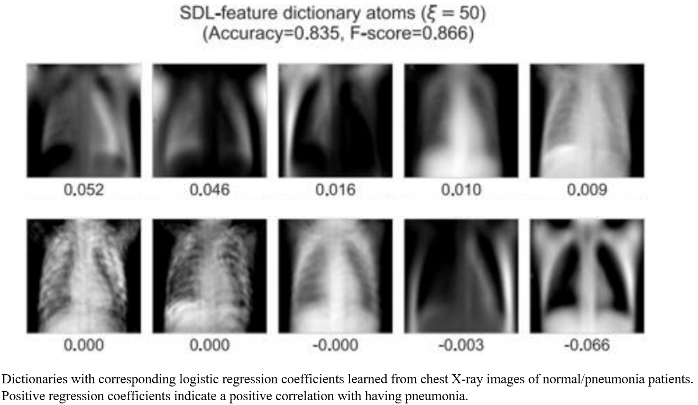

Hi!

I am **Joowon Lee**, a Ph.D. student in the Department of Statistics at the University of Wisconsin-Madison.

I am interested in the fields of causal inference and machine learning. My general research interest is to learn important latent features on large datasets for classification or prediction tasks. I seek methods that can give interpretable results so that they can be widely used and communicated. 

While I love to help individual patients to improve their health conditions, my ultimate goal is to develop novel statistical methods for medical and public health studies, aiming for the overall improvement of public health status. As long as I can pursue these goals, I am not yet confined to any particular type of job (e.g. academia or industry). 

## Education 

I earned my B.S. in Statistics and Nursing, and M.S. in Statistics at Seoul National Unversity in South Korea. Before joining UW-Madison, I worked as an emergency room nurse at Hyundai Asan medical center in South Korea and participated in various projects such as finding susceptible genes related to pancreatic cancer by dealing with clinical data, microarray, and sequencing data.

## Research 

Here are some of my current and previous projects: 

1. Joowon Lee and Guanhua Chen, \
 *"Robust weighting to facilitate individualized multi-stage treatment rule learning"* (In preparation)
 
   - My current ongoing work with Prof. Chen is on developing three-way balancing methods to decide the optimal multi-stage treatments (e.g., COVID-19 vaccine) for each individual given the initial baseline covariate. 
   
&nbsp;

2. Joowon Lee, Hanbaek Lyu, and Weixin Yao,\
*"Supervised Dictionary Learning with Auxiliary Covariates*" ([arXiv](https://arxiv.org/abs/2206.06774) 2022, 61 pp, [GitHub](https://github.com/ljw9510/SDL))

   - The recent work 2 on *supervised dictionary learning* provides a novel statistical method for finding class-discriminative dictionaries to perform supervised learning in the framework of dictionary learning. 

&nbsp;

3. Joowon Lee, Seungyeoun Lee, Jin-Young Jang, and Taesung Park, \
*"Exact association test for small size sequencing data*"([Journal](https://bmcmedgenomics.biomedcentral.com/articles/10.1186/s12920-018-0344-z) 2018, 12 pp)

   - In 3, we propose a new exact association test for sequencing data that does not require a large sample approximation based on the Generalized Cochran-Mantel-Haenszel (GCMH) statistic. It is applicable to most sequencing data which is generally restricted to a small sample size due to its-still high cost.
